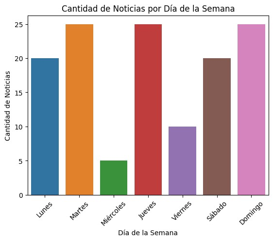

# Análisis Exploratorio de Datos sobre noticias de El Diario de Hoy
## Datos de referencia
En esta sección vamos a realizar un Análisis Exploratorio de Datos (EDA) a partir de la técnica de webscraping. En función de esto, se logró extraer una serie de variables para desarrollarlo. Entre las variables que pudimos obtener de la página de El Diario de Hoy fueron las siguientes:

* Título
* Resumen
* Autor
* Fecha
* Noticia
* Keywords
* URL
* Categoría
### Importación de librerías
````python
import pandas as pd
import seaborn as sns
import matplotlib.pyplot as plt
import numpy as np
import matplotlib.dates as mdates
````
### Leer el archivo CSV
````python
df = pd.read_csv('/content/news_elsalvador_vf.csv')
````
## Análisis exploratorio
Muestra las primeras 10 filas
````python
df.head(5)
````

|| Titulo | Resumen | Autor |  Fecha | Noticia | Keywords | URL | Categoria |
|---|---|---|---|---|---|---|---|---|
|  0 |  Envían a prisión a dos hombres acusados de est... |  Manuel Antonio Hernández y René Gustavo Rodríg... |  Emilce Rivera |  Nov 28, 2023- 12:30 |  La Fiscalía General de la República (FGR) info... |  [' Asesinatos ', ' Fiscalía General ', ' Homic... |  https://www.elsalvador.com/noticias/nacional/h... |  nacional | 
| 1 | Envían a juicio a hombre que asesinó a su pare... | La jueza determinó la existencia de suficiente... | Lissette Lemus | Nov 28, 2023- 10:21|El Juzgado Especializado de Instrucción para u... | [' Feminicidio ', ' Juzgados ', ' Sucesos ', '... | https://www.elsalvador.com/noticias/nacional/f... | nacional |
|2|EE. UU. y El Salvador dialogan sobre lucha con...|El presidente Bukele se limitó a compartir en ...|AFP|Nov 28, 2023- 07:44|El asesor de Seguridad de la vicepresidencia d...|[' Estados Unidos ', ' Nayib Bukele ', ' Pandi...|https://www.elsalvador.com/noticias/nacional/e...|nacional|
|3|Sujetos robaron joyas de alta gama en El Encan...|Cuatro sujetos sospechosos de robar 60,000 dól...|Lissette Lemus|Nov 28, 2023- 07:24|Cuatro hombres acusados de hurtar dinero y joy...|[' Fiscalía General ', ' Hurtos ', ' Robos ', ...|https://www.elsalvador.com/noticias/nacional/h...|nacional|
|4|Corte Suprema de Panamá declara "inconstitucio...|Tras el anuncio se desataron celebraciones de ...|AFP|Nov 28, 2023- 08:51|La Corte Suprema de Panamá declaró este martes...|[' Internacional ', ' Minería ', ' Panamá ']|https://www.elsalvador.com/noticias/internacio...|internacional|

### Descripción de la data
````python
df.describe()
````
| |Titulo|Resumen|Autor|Fecha|Noticia|Keywords|URL|Categoria|
|---|---|---|---|---|---|---|---|---|
|count|370|370|370|180|370|370|370|370|
|unique|77|58|29|30|58|67|77|14|
|top|Antiinmigrante|No se encontró resumen|No se encontró autor|No se encontró fecha|Por Paolo LuersPeriodista|[' Las Cartas De Paolo Lüers ', ' Opinión ']|https://www.elsalvador.com/opinion/caricaturas...|caricaturas|
|freq|5|65|185|50|75|35|5|50|
### La data contiene 370 filas y 8 columnas
````python
df.shape
````
````
(370, 8)
````
````python
df.dtypes
````
````
Titulo object
Resumen object 
Autor object 
Fecha object 
Noticia object 
Keywords object 
URL object 
Categoria object 
dtype: object
````
### Transformar la variable Fecha a un formato adecuado para el análisis e imprimir las primeras filas  
````python
df['Fecha'] = pd.to_datetime(df['Fecha'], format='%b %d, %Y- %H:%M', errors='coerce')
print(df.head())
````
````
                                           Titulo \ 
0 Envían a prisión a dos hombres acusados de est... 
1 Envían a juicio a hombre que asesinó a su pare... 
2 EE. UU. y El Salvador dialogan sobre lucha con... 
3 Sujetos robaron joyas de alta gama en El Encan... 
4 Corte Suprema de Panamá declara "inconstitucio... 

                                            Resumen          Autor \ 
0 Manuel Antonio Hernández y René Gustavo Rodríg... Emilce Rivera 
1 La jueza determinó la existencia de suficiente... Lissette Lemus 
2 El presidente Bukele se limitó a compartir en ... AFP 
3 Cuatro sujetos sospechosos de robar 60,000 dól... Lissette Lemus 
4 Tras el anuncio se desataron celebraciones de ... AFP Fecha 

                                                               Noticia \ 
0 2023-11-28 12:30:00 La Fiscalía General de la República (FGR) info... 
1 2023-11-28 10:21:00 El Juzgado Especializado de Instrucción para u... 
2 2023-11-28 07:44:00 El asesor de Seguridad de la vicepresidencia d... 
3 2023-11-28 07:24:00 Cuatro hombres acusados de hurtar dinero y joy... 
4 2023-11-28 08:51:00 La Corte Suprema de Panamá declaró este martes... 

                                           Keywords \ 
0 [' Asesinatos ', ' Fiscalía General ', ' Homic... 
1 [' Feminicidio ', ' Juzgados ', ' Sucesos ', '... 
2 [' Estados Unidos ', ' Nayib Bukele ', ' Pandi... 
3 [' Fiscalía General ', ' Hurtos ', ' Robos ', ... 
4 [' Internacional ', ' Minería ', ' Panamá '] 

                                                URL		Categoria 
0 https://www.elsalvador.com/noticias/nacional/h... 	nacional 
1 https://www.elsalvador.com/noticias/nacional/f... 	nacional 
2 https://www.elsalvador.com/noticias/nacional/e... 	nacional 
3 https://www.elsalvador.com/noticias/nacional/h... 	nacional 
4 https://www.elsalvador.com/noticias/internacio... 	internacional
````
### Crear un DataFrame agrupando por la fecha y contando el número de noticias por día
````python
data_agrupada = df.groupby(df['Fecha'].dt.date).size()
````
 ### Crear y mostrar el gráfico de líneas
````python
plt.figure(figsize=(8,  6))
plt.plot(data_agrupada.index, data_agrupada, marker='o', linestyle='-')
````
  ### Configuración de las etiquetas de las fechas
````python
plt.gca().xaxis.set_major_formatter(mdates.DateFormatter('%Y-%m-%d'))
plt.gca().xaxis.set_major_locator(mdates.AutoDateLocator())
plt.xticks(rotation=45, ha='right')  # Rotar las fechas para mejor visualización
````
### Configuración adicional del gráfico
````python
plt.xlabel('Fecha')
plt.ylabel('Cantidad de Noticias')
plt.title('Distribución de Noticias a lo Largo del Tiempo')
plt.grid(True)
````  
### Ajustar el layout y mostrar el gráfico
````python
plt.tight_layout()  # Ajusta los parámetros del subplot para que encaje en el área del gráfico
plt.show()
````


### Extraer el día de la semana (0 es lunes, 6 es domingo)
````python
df['Dia_Semana'] = df['Fecha'].dt.dayofweek
````  
### Crear una copia de los datos para evitar SettingWithCopyWarning
````python
data_clean = df.dropna(subset=['Dia_Semana']).copy()
```` 
### Convertir 'Dia_Semana' a tipo entero
````python
data_clean['Dia_Semana'] = data_clean['Dia_Semana'].astype(int)
````  
### Agrupar por día de la semana y contar el número de noticias
````python
conteo_dias_semana = data_clean.groupby('Dia_Semana').size()
````  
### Crear un mapeo de números a nombres de días
````python
dias = ['Lunes',  'Martes',  'Miércoles',  'Jueves',  'Viernes',  'Sábado',  'Domingo']
conteo_dias_semana.index = [dias[dia]  for dia in conteo_dias_semana.index]
````  
### Crear el gráfico de barras
````python
sns.barplot(x=conteo_dias_semana.index, y=conteo_dias_semana.values)
````  
### Etiquetas y título
````python
plt.xlabel('Día de la Semana')
plt.ylabel('Cantidad de Noticias')
plt.title('Cantidad de Noticias por Día de la Semana')
plt.xticks(rotation=45)
plt.show()
````

